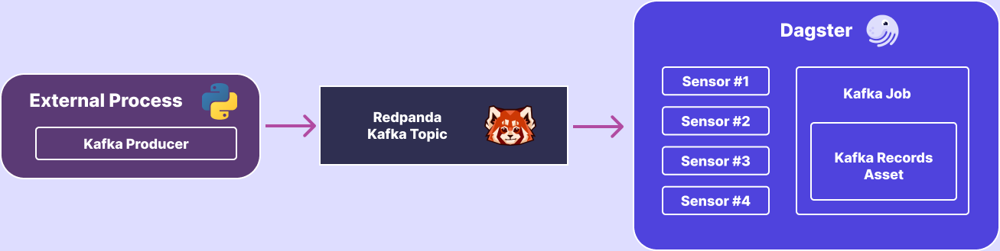

## Ingesting Kafka Streams with Dagster

Say you're working at a financial institution, with transactions being processed real-time on a message broker like Apache  Kafka. How would you ingest that data into your data warehouse for analytics and reporting?

One option would be to use the [Amazon Data Firehose]() integration to automatically write files to storage, and then batch process those files from your orchestrator. However, this relies on us having two-stages of data ingestion: writing of records to cloud storage, and then processing of those files.

An alternative approach would be to use Dagster sensors to subscribe to the Kafka topic, and launch asset materializations on small batches of records. In this post, we'll be walking through a project where we set up a Kafka stream, and build a Dagster pipeline for ingesting this data in near-real-time.




`<add note about retention windows, and reading from beginning of window>`

### Setup

We're going to use [Redpand](https://redpanda.com/) to run a dockerized version of Kafka locally.

If you're on macOS and use [Homebrew](https://brew.sh/) you can install it using the following command, otherwise, reference the official [installation instructions](https://github.com/redpanda-data/redpanda/?tab=readme-ov-file#prebuilt-packages).

```bash
$ brew install redpanda-data/tap/redpanda
```

Then, ensure Docker is running on your machine, and simply start the container:

```bash
$ rpk container start
Checking for a local image...
Starting cluster...
Waiting for the cluster to be ready...

Cluster started!
NODE-ID  STATUS   KAFKA-ADDRESS    ADMIN-ADDRESS    PROXY-ADDRESS    SCHEMA-REGISTRY-ADDRESS
0        running  127.0.0.1:58550  127.0.0.1:58549  127.0.0.1:58551  127.0.0.1:58552
```

Run the `rpk cluster info` command, and make note of the port being used by the broker. We will be using this when connecting to the service.

```bash
$ rpk cluster info
CLUSTER
=======
redpanda.c9aabe25-1ca1-4d08-b972-17838f093066

BROKERS
=======
ID    HOST       PORT
0*    127.0.0.1  52000
```

Next, we're going to scaffold out a new Dagster project. With the Dagster command-line utility on your system (`pip install dagster`), 

```bash
$ dagster project scaffold --name dagster-kafka-demo
$ cd dagster-kafka-demo
```

Update `setup.py` to include the `kafka-python` library, and then install the project dependencies.

```python
from setuptools import find_packages, setup

setup(
    name="dagster_kafka_demo",
    packages=find_packages(exclude=["dagster_kafka_demo_tests"]),
    install_requires=[
        "dagster",
        "dagster-cloud",
        "kafka-python",  # <-- added dependency
    ],
    extras_require={"dev": ["dagster-webserver", "pytest"]},
)
```

```bash
$ pip install -e .[dev]
```

There we have it, we've got a Dagster project setup, and a  Kafka service running in the background.

### Generate Kafka stream data

Before we write our pipeline for ingesting data, let's write a producer that generates messages to our Kafka topic. Create a file named `kafka_producer.py` at the root of your project, and add the following code.

```python
import json
import random
import time

from kafka import KafkaProducer


PRODUCER_THROUGHPUT_PER_SECOND = 1_000
BOOTSTRAP_SERVERS = ["localhost:52000"]
TOPIC_NAME = "demo_topic_1"
TOPIC_CATEGORIES = ["option1", "option2", "option3"]

producer = KafkaProducer(bootstrap_servers=BOOTSTRAP_SERVERS)

for i in range(0, 100_000):
    payload = {"category": random.choice(CATEGORIES), "value": i}
    producer.send(TOPIC_NAME, json.dumps(payload).encode("utf-8"))
    time.sleep(1 / PRODUCER_THROUGHPUT_PER_SECOND)
```

In this code we are generating `PRODUCER_THROUGHPUT_PER_SECOND` records per second, to the `TOPIC_NAME` topic. We are writing a JSON payload with the structure of `{"category": <str>, "value": <int>}` containing a randomly selected category.

### Ingesting streams with Dagster

Now that we have a way to generate data on our Kafka topic, let's process it!

To start, let's create a `KafkaResource` that we can use from our sensors to read the topic.

```python
from typing import List

from dagster import ConfigurableResource
from kafka import KafkaConsumer


class KafkaResource(ConfigurableResource):
    bootstrap_servers: List[str]
    topic_name: str

    def get_consumer(self):
        return KafkaConsumer(
            self.topic_name,
            group_id="group1",
            bootstrap_servers=self.bootstrap_servers,
            fetch_min_bytes=4000,
        )
```


Next, let's create a sensor (or multiple...) that will subscribe to the Kafka topic, create small batches, and send them to run request to be materialized. To make sure that we have enough throughput reading the Kafka topic, we will have multiple sensors running in parallel reading from the Kafka topic. We will accomplish this by creating a factory method to produce sensors, each of which that will 

```python
from datetime import datetime

from dagster import (
    DefaultSensorStatus,
    RunConfig,
    RunRequest,
    sensor,
)

from dagster_kafka_demo.assets import KafkaConsumerConfig, kafka_consumer_output_job
from dagster_kafka_demo.resources import KafkaResource

MAX_BATCH_SIZE = 50
MAX_SENSOR_TICK_RUNTIME = 30
TIME_BETWEEN_SENSOR_TICKS = 40


def sensor_factory(replica_id: int):
    @sensor(
        minimum_interval_seconds=TIME_BETWEEN_SENSOR_TICKS,
        job_name=kafka_consumer_output_job.name,
        default_status=DefaultSensorStatus.RUNNING,
        name=f"watch_kafka_{replica_id}",
    )
    def watch_kafka(kafka: KafkaResource):
        """A sensor that consumes events from kafka and launches enqueues runs for them."""
        # for each sensor loop, create a consumer and read up to MAX records
        consumer = kafka.get_consumer()
        tstart = datetime.now()

        while (datetime.now() - tstart).seconds < MAX_SENSOR_TICK_RUNTIME:
            msgs = consumer.poll(max_records=MAX_BATCH_SIZE, timeout_ms=2000)

            batch = []
            max_offset = None

            for messages in msgs.values():
                for message in messages:
                    batch.append(message.value.decode("utf-8"))
                    max_offset = message.offset

            if len(batch) > 0: yield RunRequest(
                    run_key=f"max_offset_{max_offset}",
                    run_config=RunConfig(
                        ops={
                            "loaded_from_kafka": KafkaConsumerConfig(
                                max_offset=str(max_offset), batch=batch
                            )
                        }
                    ),
                )

            consumer.commit()

    return watch_kafka
```

As you can see, each tick of the sensor runs for the allocated `MAX_SENSOR_TICK_RUNTIME` duration. It reads records until it reaches the `MAX_BATCH_SIZE`, and then for those messages, it passes them to our `kafka_messages` asset included in the `kafka_consumer_output_job` job.

Let's take a look at how we've defined the `kafka_messages` asset, and `kafka_consumer_output_job`.

```python
from typing import List

from dagster import (
    AssetSelection,
    Config,
    MaterializeResult,
    OpExecutionContext,
    asset,
    define_asset_job,
)


class KafkaConsumerConfig(Config):
    max_offset: str
    batch: List[str]


@asset
def kafka_messages(
    context: OpExecutionContext, config: KafkaConsumerConfig
) -> MaterializeResult:
    context.log.info(f"Handling kafka batch with values {config.batch}")

    # process your messages here
    print(len(batch))

    return MaterializeResult(
        metadata={
            "kafka_batch_size": len(config.batch),
            "kafka_batch_value_start": config.batch[0],
            "kafka_batch_value_end": config.batch[-1],
        }
    )


kafka_consumer_output_job = define_asset_job(
    name="kafka_consumer_output", selection=AssetSelection.assets(loaded_from_kafka)
)
```

We are defining a configuration for our asset, `KafkaConsumerConfig` that takes in the list of messages as `batch`, along with the `max_offset` key; we are able to process the records of the batch on `config.batch`. Then, we return a `MaterializeResult` with _metadata_ associated with the batch that was processed.


There is one final step required before we can run this in Dagster, and that is registering our assets, jobs, sensors, and resources in our `Definitions` object.

```python
from dagster import Definitions

from dagster_kafka_demo.assets import kafka_consumer_output_job, kafka_messages
from dagster_kafka_demo.resources import KafkaResource
from dagster_kafka_demo.sensors import sensor_factory

SENSOR_REPLICAS = 4

defs = Definitions(
    assets=[kafka_messages],
    jobs=[kafka_consumer_output_job],
    sensors=[sensor_factory(i) for i in range(SENSOR_REPLICAS)],
    resources={
        "kafka": KafkaResource(
            bootstrap_servers=["localhost:52000"],
            topic_name="demo_topic_1",
        )
    },
)
```

The project code in its entirety can be found in [this GitHub repository](https://github.com/cmpadden/dagster-kafka-demo/tree/b6c7fbb6939f0980edcc4d0209596a3e4275224b/dagster_kafka_demo).

### Running our pipelines

`<todo insert gif/video>`
